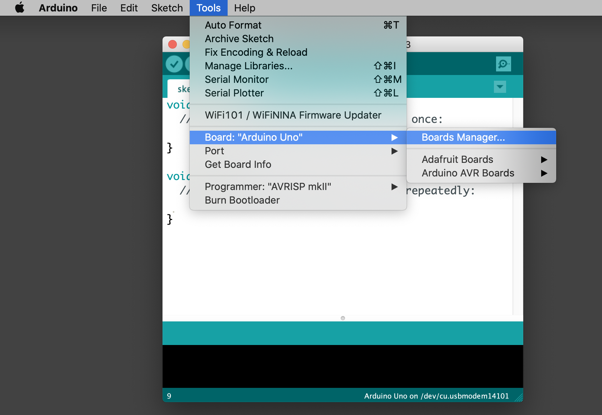
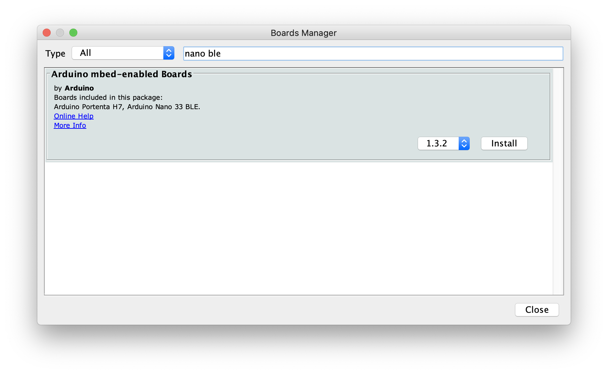
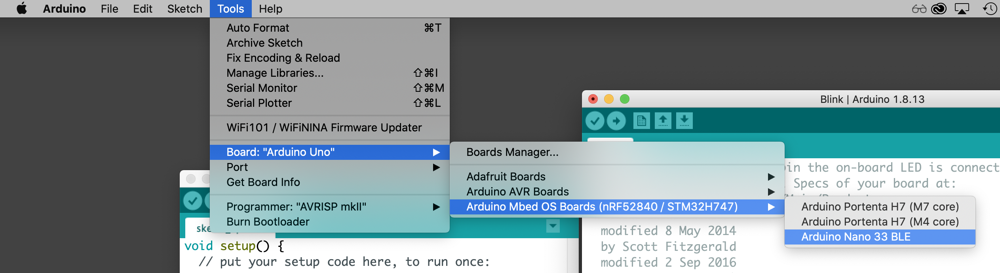
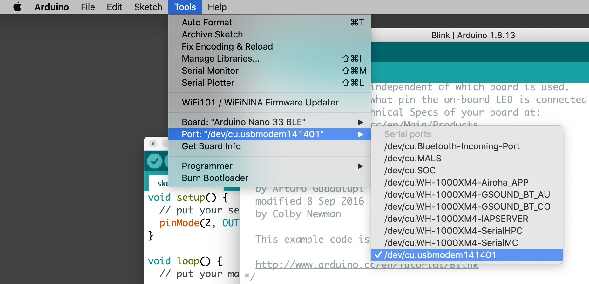
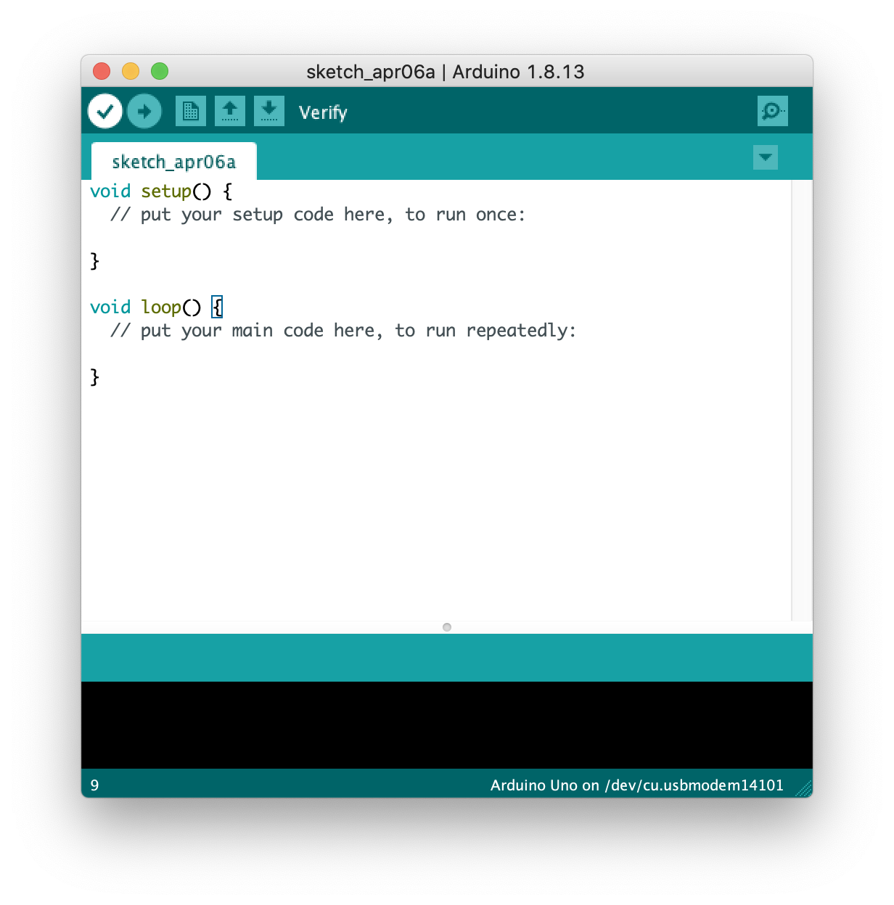
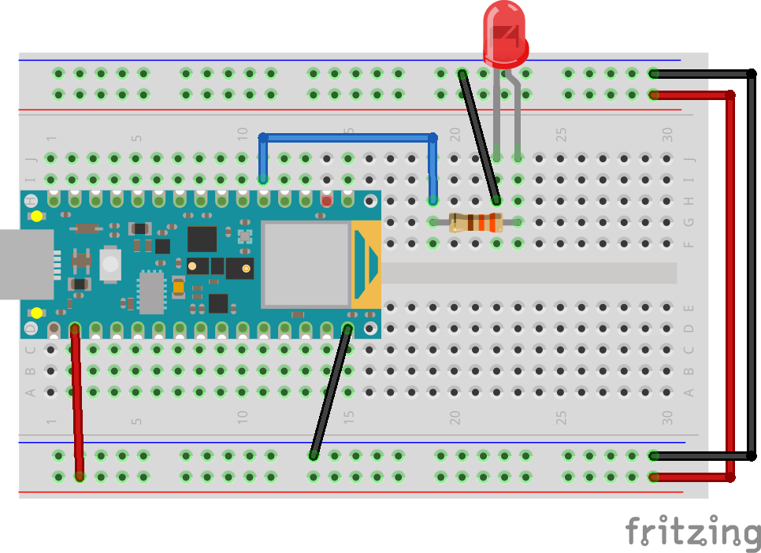
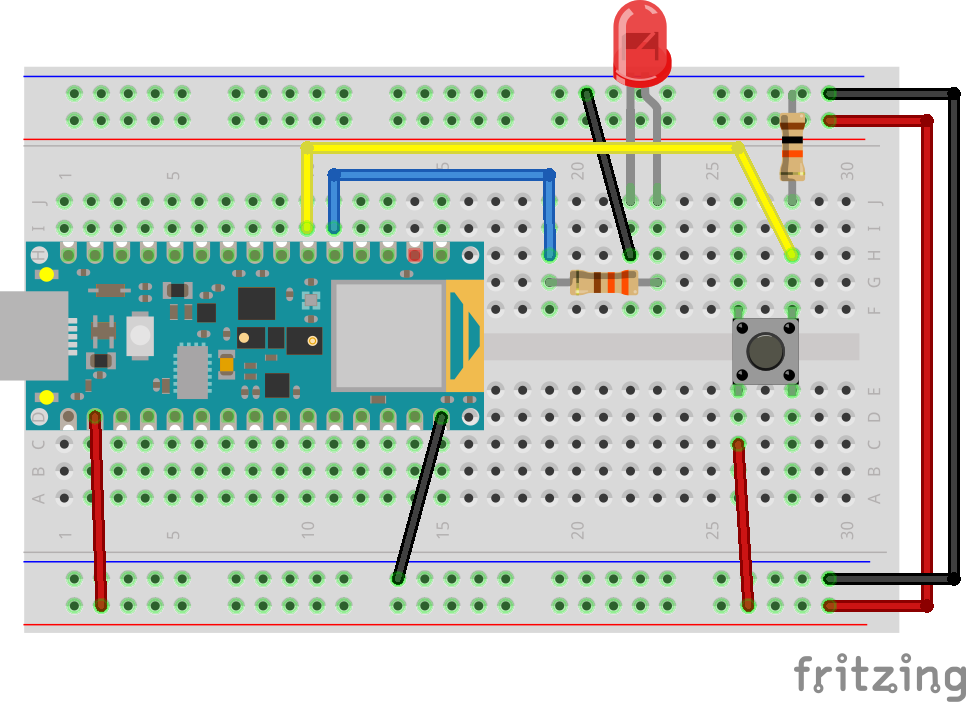
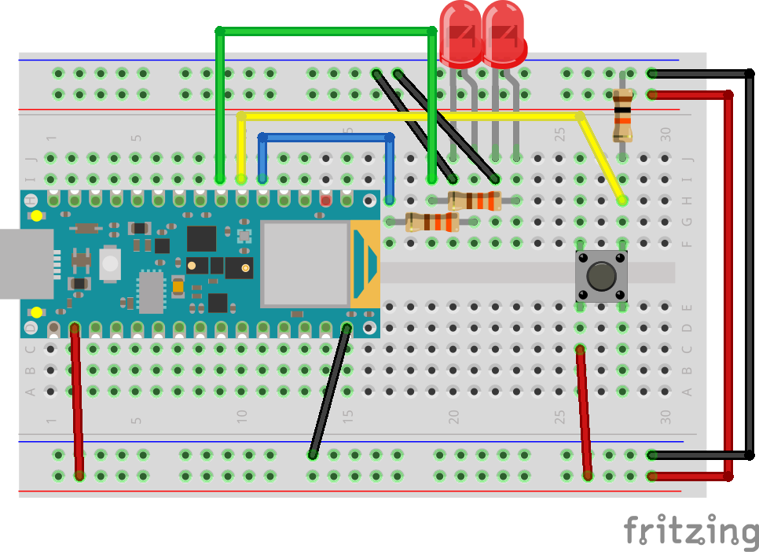

## Week 10: Digital Input & Output

[back to main](../index.md)

### Setting up the Arduino IDE

#### Downloading the IDE

* [Download](https://www.arduino.cc/en/software) the Arduino IDE for your operating system
  * For Mac users, after you unzip the download, you will want to move the Arduino app to the Applications folder.
* [Very detailed notes](https://www.arduino.cc/en/Guide/Environment) on the Arduino IDE

#### Setting up the Arduino Nano 33 BLE Board

* We will need to download a package for the Arduino IDE to recognize our board.

* Navigate to Tools > Board (might say Board: "Arduino Uno") > Boards Manager...



* Search for "Nano 33 BLE" in the Boards Manager. Find the board package by Arduino. Click "Install". This will take a couple of minutes to complete.



* Once installation is complete, navigate to Tools > Board. You should now see an option that says "Arduino Mbed OS Boards". Select "Arduino Nano 33 BLE" in that category of boards.



#### Port Selection

* You will need to select which port the board is connected to. You need to specify this because you could have multiple Arduino boards connected to a computer at the same time. 
* Navigate to Tools > Port. You should see a list of available ports.
* Make sure your Arduino board is connected via a USB cable. For Mac users, look for something that starts with `/dev/cu.usbmodem`. For Windows users, you should normally see less ports listed and should look for something that starts with `COM`. 




### Pins on Your Arduino Board


* [Full pinout diagram](https://content.arduino.cc/assets/Pinout-NANOble_latest.pdf) for Arduino Nano 33 BLE

* Power and Ground
  * There are two ground pins on either side of our board. On the actual board, it's marked with white paint around the pin. You can use any of the two ground pins.
  * There are 3 different power pints on the board
    * **+3V3 pin will provide 3.3V power. This is the pin that we will be using to supply power to our circuit**, because the pins on this board runs on 3.3V.
    * VIN pin will give you whatever the power (volts) it is being supplied by the USB cable.
    * +5V pin will provide 5V power
* Digital pins
  * All pins on the right side of the board, starting with 'D' are digital pins that can be used either for digital input and output.
  * '~D2' means that that pin is a digital pin number 2. When we program our Arduino code, we will need to reference the pin numbers.
    * The '~' symbol also means something. We will talk about this next week.
* Analog pins
  * All pins on the left side of the board starting with 'A' are analog pins. More on this next week.

* RX and TX pins
  * These are special pins used for communication protocols. There will be special times where we need to connect things to these pins, but for the scope of this class, we won't need to bother these pins.


### Programming Arduino Boards

* Last week, we've made LEDs light up when switches are pressed -- we've been limited to having our circuit do one thing at a time.

* With programming, we can have our hardware components do multiple things at the same time.

#### The Arduino Language

* Programming Arduino boards is going to be slightly different from programming sketches using p5.js. In order to create programs for our Arduino board, we will need to use another programming language called **the Arduino language** which is a variant of C with a few C++ features.
  * [Arduino Language Reference](https://www.arduino.cc/reference/en/)  
* There will be some differences to the programming syntax -- different language means they use different "grammar" (aka. syntax)
* Biggest difference is that the Arduino language, like C, C++, Java, is a **typed** language. This means that we need to specify [data types](https://learn.sparkfun.com/tutorials/data-types-in-arduino/all) for our variables and functions. 

#### Structure of Arduino Program

* When you open up a new sketch, below is the default skeleton code that you will get:

```c
void setup() {
  // put your setup code here, to run once:
  pinMode(2, OUTPUT);
}

void loop() {
  // put your main code here, to run repeatedly:
  
}
```

* The structure should look familiar -- there is a `setup()` function that ones once, at the beginning of the programming running on the board. There is a `loop()` function that runs in a loop (just like our `draw()` function for p5.js sketches!)
* Comments are written with `//` in front, just like in JavaScript.

* The `void` in front of the `setup()` and `loop()` funtion calls indicate that these functions have no return value -- meaning that when the functions run, they don't have an end output.

#### Running Arduino Code

* To run an Arduino program means to **compile** your code. Compiling code means to translate a **high-level language** (basically all programming languages we use to code, such as C, C++, Java, JavaScript, Python...) into assembly code or machine language. You can compile and verify that your Arduino program will have no errors by clicking on the check "verify" button.



#### Uploading Arduino Code

* After verifying that your Arduino code has no errors, click on the right arrow button -- the upload button. In order for the upload to succeed, you will need to have the correct board and port selected.


### Digital Input and Output

* All digital poins on our board can be programmed to be a digital input and a digital output

#### Blink 1 LED



* Components used: 1 LED, 330 Ohm resistor.
* The left end of the blue wire is connected to the D2 pin (5th on on from the bottom on the left side).
* Our blink code:

```c
// the setup function runs once when you press reset or power the board
void setup() {
  // initialize digital pin 2 as an output.
  pinMode(2, OUTPUT);
}

// the loop function runs over and over again forever
void loop() {
  digitalWrite(2, HIGH);   // turn the LED on (HIGH is the voltage level)
  delay(1000);                       // wait for a second
  digitalWrite(2, LOW);    // turn the LED off by making the voltage LOW
  delay(1000);                       // wait for a second
}
```

#### 1 LED with Switch



* Components used: 1 LED, 330 Ohm resistor for LED, 1 switch, 10K Ohm resistor for switch
* The left end of the yellow wire is connected to D3 pin (6th pin from the bottom on the left side of the board)
* Our switch code:

```c
// constants won't change. They're used here to set pin numbers:
const int buttonPin = 3;     // the number of the pushbutton pin
const int ledPin =  2;      // the number of the LED pin

// variables will change:
int buttonState = 0;         // variable for reading the pushbutton status

void setup() {
  // initialize the LED pin as an output:
  pinMode(ledPin, OUTPUT);
  // initialize the pushbutton pin as an input:
  pinMode(buttonPin, INPUT);
}

void loop() {
  // read the state of the pushbutton value:
  buttonState = digitalRead(buttonPin);

  // check if the pushbutton is pressed. If it is, the buttonState is HIGH:
  if (buttonState == HIGH) {
    // turn LED on:
    digitalWrite(ledPin, HIGH);
  } else {
    // turn LED off:
    digitalWrite(ledPin, LOW);
  }
}
```

#### 2 LEDs, 1 Switch



* Components used: 2 LED, 2 * 330 Ohm resistor for LED, 1 switch, 10K Ohm resistor for switch
* The left end of the green wire is connected to D4 pin (7th pin from the bottom on the left side of the board)

* Our 2 LEDs code:

```c
// constants won't change. They're used here to set pin numbers:
const int buttonPin = 3;     // the number of the pushbutton pin
const int ledPin =  2;      // the number of the LED pin
const int offLedPin = 4;

// variables will change:
int buttonState = 0;         // variable for reading the pushbutton status

void setup() {
  // initialize the LED pin as an output:
  pinMode(ledPin, OUTPUT);
  // initialize the pushbutton pin as an input:
  pinMode(buttonPin, INPUT);
  // initialize the offLedPin pin as an output:
  pinMode(offLedPin, OUTPUT);
}

void loop() {
  // read the state of the pushbutton value:
  buttonState = digitalRead(buttonPin);

  // check if the pushbutton is pressed. If it is, the buttonState is HIGH:
  if (buttonState == HIGH) {
    // turn LED on:
    digitalWrite(ledPin, HIGH);
    // turn offLedPin off:
    digitalWrite(offLedPin, LOW);
  } else {
    // turn LED off:
    digitalWrite(ledPin, LOW);
    // turn offLedPin on:
    digitalWrite(offLedPin, HIGH);
  }
}
```

#### Challenge: 2 LEDs, 2 Switches

* Can you create a circuit for 2 LEDs, and 2 Switches? How can you program each switch to trigger an LED?