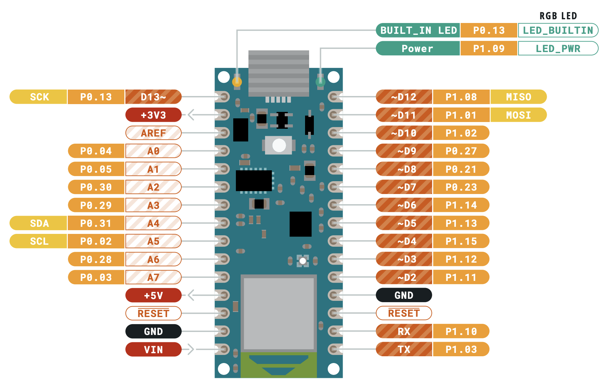

## Week 11: Analog Input & Output

[back to main](../index.md)


### Analog Inputs and Outputs

* [Analog to Digital Converter (ADC)](https://learn.sparkfun.com/tutorials/analog-to-digital-conversion/all#:~:text=The%20ADC%20on%20the%20Arduino,ADC%20works%20is%20fairly%20complex.) is a special circuit on Arduino boards that allow us to translate voltage into numeric representation
* Arduino boards use a 10-bit resolution for sampling voltages to translate into numeric representation, meaning that our analog inputs and outputs will range between 0 and 1023.
  * On the Nan 33 BLE: 0 analog value corresponds to 0 volts, 1023 corresponds to 3.3V

### Analog Pins on Your Arduino Board



* [Full pinout diagram](https://content.arduino.cc/assets/Pinout-NANOble_latest.pdf) for Arduino Nano 33 BLE
* We have 8 analog input pins on our board on the left side (A0 - A7)

### Analog Input

#### Connecting a Potentiometer

* [Potentiometer](http://fddrsn.net/pcomp/examples/potentiometers.html) is a self-contained [voltage divider](https://learn.sparkfun.com/tutorials/voltage-dividers), often in form of a knob or a slider.


* The center pin acts as a wiper moving across the resistive material. The voltage coming off the center pin (the wiper) increases the further it moves away from pin A, where power is applied. We measure the voltage of the center pin on the Arduino.
* Potentiometers are NOT polarized -- pin A and pin B is interchangeable
* We can read analog input from analog sensors using the `analogRead()` function
  * No need to define `pinMode()` for analog pins -- analog pins are input ONLY


* In the above diagram, the left pin of potentiometer is connected to power and the right pin is connected to ground. The middle pin is connected to the A0 pin (4th from the top, on the left side of the board.)

#### Monitoring Analog Input with Serial Monitor

* We can monitor our analog input readings with [Serial communication](https://www.arduino.cc/reference/en/language/functions/communication/serial/)
* Code to monitor our potentiometer value:

```c
const int potPin = A0; // name analog pin for potentiometer
int potVal; // holds the potentiometer value

void setup() {
  // put your setup code here, to run once:
  Serial.begin(9600); // open the serial connection at 9600 baud
}

void loop() {
  // put your main code here, to run repeatedly:
  potVal = analogRead(potPin); // read the potentiometer value, save it in a variable
  Serial.println(potVal); // send the value of the sensor over the serial monitor
  delay(2); // slight pause to make sure Serial gets printed without clogging
}
```

* After your compile and upload the above code to your board, click on the magnifying class icon on the top right corner of your IDE. You should get a popup window of the Serial Monitor like below that displays the value of  your potentiometer


#### Connecting a Photocell

* For most other analog sensors, like photocells and flex sensors, you will need to add a pull down resistor to the circuit, just like how we needed to use the 10K resistor for our switches.
* A general rule of thumb for selecting the proper resistor value is to match the maximum sensor resistance. If you aren’t sure, start with a 10k resistor and see what your output is like.
* Photocell measures the brightness of the area right above it. Experiement with the sensitivity of the measurement of light.


* In the above diagram, the left pin of photocell is connected to power and the right pin is connected to ground via a 10K Ohm resistor. The right pin is also connected to the A0 pin (4th from the top, on the left side of the board.)
* Use same code for the potentiometer circuit above to see the analog input from the photocell sensor.

### Analog Output

* On the Arduino board diagram, you'll notice that the digital pins have a ~ sign next to the pin number (~D2, ~D3...). These are called **PWM pins**.
  * Different boards have different number of pins. On our board, all digital pins just so happens to be also PWM pins, but this might not be the case for other Arduino boards
* PWM pins can fake analog output (variable voltage) with a techique called **Pulse Width Modification** (PWM).
* PWM is a method in which you pulse a pin on and off rapidly to give the illusion of a variable voltage. This is also called an effective voltage. The Arduino has an 8-bit PWM, which means there are 256 discrete steps (values between 0 and 255) available to us.
* We can do an analog write to PWM pins using the `analogWrite()` function.

#### Controlling LED Brightness with a Potentiometer


* The left end of the red wire for the LED is connected to the D2 pin (5th on on from the bottom on the left side). The resistor used for the LED circuit is a 330 Ohm resistor.
* Code to controll brightness of your LED with a potentiometer

```c
const int sensorPin = A0; // name analog pin for potentiometer
const int ledPin = 2; // led on D2 PWM pin
int sensorVal;// holds the sensor value
int ledBright;// LED brightness

void setup(){
    pinMode(ledPin, OUTPUT);
}

void loop(){
    sensorVal = analogRead(sensorPin); // read the sensor value, save it in a variable
    ledBright = sensorVal / 4; // divide by 4 to scale appropriately
    analogWrite(ledPin, ledBright); // PWM the LED
    delay(2); // settle the ADC
}
```

#### Mapping Photocell input to LED Brightness


* You can try to controll the brightness of the LED using the same code in the above section, but will quickly notice that the range of controll you have for the brightness is smaller. This is because the photocell sensor rarely reaches a minimum of 0 nor does it go all the way up to 1023 when the environment is bright.
* We can use the `map()` function to control the range of analog value that we can expect from a given environment (this usually requires a bit of time watching the serial monitor and looking at the values).

```c
const int sensorPin = A0; // name analog pin for potentiometer
const int ledPin = 2; // led on D2 PWM pin
int sensorVal;// holds the sensor value
int ledBright;// LED brightness

void setup(){
    pinMode(ledPin, OUTPUT);
}

void loop(){
    sensorVal = analogRead(sensorPin); // read the sensor value, save it in a variable
    ledBright = map(sensorVal, 150, 400, 0, 255); // map sensorVal between 150 to 400 to a number between 0 and 255
    analogWrite(ledPin, ledBright); // PWM the LED
    delay(2); // settle the ADC
}
```

* In the example code above, I'm expecting sensorVal to be between 150 and 400, but this may be different for you.
* There are other ways to deal with sensors that depend on the environment -- [you can calibrate](https://www.arduino.cc/en/Tutorial/BuiltInExamples/Calibration) your sensor at the beginning of the program running

### Servo Motors

* [Intro to Servo Motors](https://vimeo.com/372278570#t=0m0s)
* Connecting servo motors:
  * **Not all servos have same wiring colors!** For the SG92R micro servo motors we have in our kit, brown is ground, orange is power and yellow is signal. 
  * Below, our signal for the servo motor is connected to the ~D9 pin. The signal pin for the servo motor must be a PWM pin.


* Example code:

```c
#include <Servo.h>

Servo myservo;  // create servo object to control a servo
// twelve servo objects can be created on most boards

int pos = 0;    // variable to store the servo position

void setup() {
  myservo.attach(9);  // attaches the servo on pin 9 to the servo object
}

void loop() {
  for (pos = 0; pos <= 180; pos += 1) { // goes from 0 degrees to 180 degrees
    // in steps of 1 degree
    myservo.write(pos);              // tell servo to go to position in variable 'pos'
    delay(15);                       // waits 15ms for the servo to reach the position
  }
  for (pos = 180; pos >= 0; pos -= 1) { // goes from 180 degrees to 0 degrees
    myservo.write(pos);              // tell servo to go to position in variable 'pos'
    delay(15);                       // waits 15ms for the servo to reach the position
  }
}
```

* In order to control servo motors in our Arduino program, you will need to include the servo motor library at the very top. This is a built-in Arduino library so you don't actually need to download anything.

### RGB LED

* Connecting RGB LED to control with 2 pots and 1 photocell


* The RGB LED will have 4 legs -- the longest leg will be the ground pin. For the rest of the color pins, take a look at the diagram below:


* Example code to control RGB with 2 potentiometers and 1 photocell:

```c
const int redPin = 2; // red led pin on ~D2
const int greenPin = 3; // green led pin on ~D3
const int bluePin = 4; // blue led pin on ~D4
const int redSensor = A0; // connect pot on A0
const int greenSensor = A1; // connect pot on A1
const int blueSensor = A2; // connect photocell on A2

int redVal; // holds red value
int greenVal; // holds green value
int blueVal; // holds blue value

void setup() {
  // put your setup code here, to run once:
  // define red, green and blue pins as digital output
  pinMode(redPin, OUTPUT);
  pinMode(greenPin, OUTPUT);
  pinMode(bluePin, OUTPUT);
}

void loop() {
  // put your main code here, to run repeatedly:
  redVal = analogRead(redSensor) / 4;
  greenVal = analogRead(greenSensor) / 4;
  // map range for photocell
  blueVal = map(analogRead(blueSensor), 150, 400, 0, 255);

  // must use analog right to control amount of red, green and blue
  analogWrite(redPin, redVal);
  analogWrite(greenPin, greenVal);
  analogWrite(bluePin, blueVal);
}
```