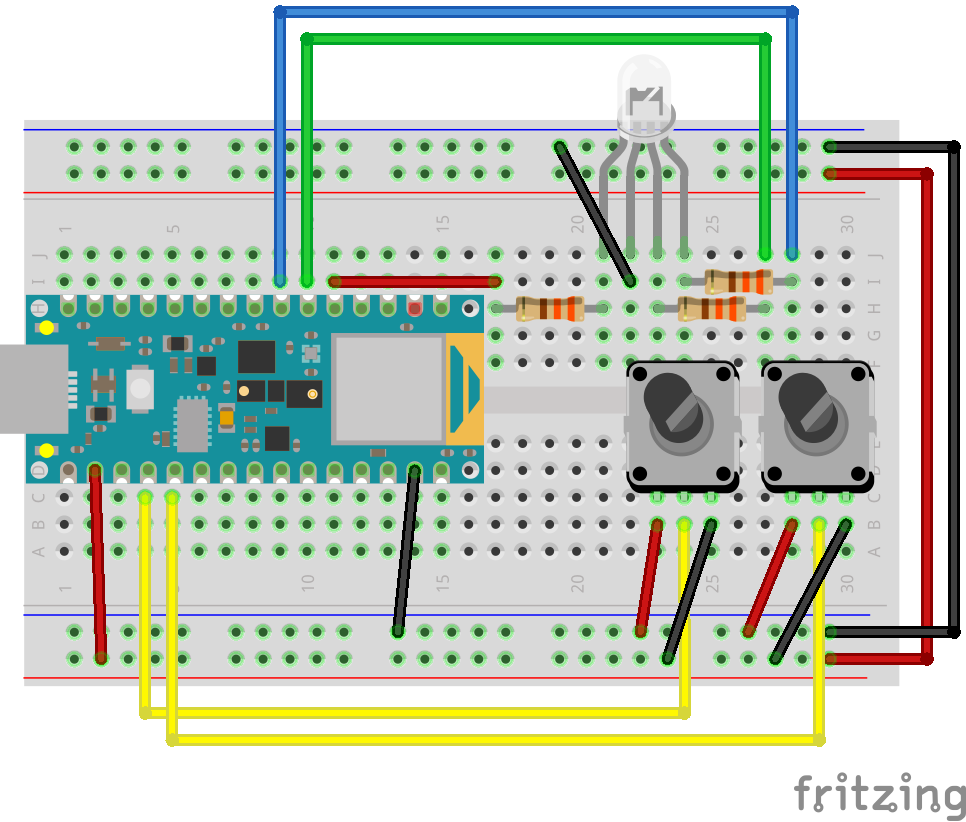

## Week 11: Serial Communication

[back to main](../index.md)

### Setting up p5.SerialControl

1. Download p5.SerialControl from [releases page](https://github.com/p5-serial/p5.serialcontrol/releases)

2. With the new security update, Chrome will prevent you from keeping downloaded .zip files from the Internet. Click on "Show All" in the download popup below.


3. In the [downloads page](chrome://downloads/), click on the "Keep dangerous file" button (I promise it's not dangerous).


4. Unzip downloaded file.


4. You should see an application called "p5.serialcontrol.app". You should move this to your Applications folder. 
5. Double click to launch -- but you might get a warning from apple. If you get a prompt like below, click "Cancel".


6. Go to System Preferences > Security & Privacy > General. You should see a warning on the bottom of the page like below. Click "Open Anyway".


7. You will get a final warning like below. Click "Open".


### Using p5.SerialControl


* If you don't see your port, try clicking "Rescan Ports"
* You can connect to a microcontroller by selecting the port in Select Port dropdown menu > "Open".
* If you open your device for serial communication using this app (technically if your device is already connected to something else), you cannot view serial communication in the Serial Monitor on Arduino IDE.
* To upload your Arduino code, you MUST disconnect from your device on p5.serialcontrol app.


* The app WILL be buggy -- if something doesn't work well, you should close and open the app again.


### Example Circuit



### Write Serial Data from Arduino

```c
int potOne = A0;
int potTwo = A1;
int valOne;
int valTwo;

void setup() {
  // put your setup code here, to run once:
  Serial.begin(9600);
}

void loop() {
  // put your main code here, to run repeatedly:
  valOne = analogRead(potOne);
  valTwo = analogRead(potTwo);

  Serial.print(valOne);
  Serial.print(", ");
  Serial.println(valTwo);
}
```


### Read Serial Data in p5.js

#### Reading serial data

* [Example code](https://editor.p5js.org/js6450/sketches/xZiF68fpb)


#### Animate using serial data

* [Example code](https://editor.p5js.org/js6450/sketches/OmS2txg7W)


### Write Serial Data in p5.js

#### Write one value

* [Example code](https://editor.p5js.org/js6450/sketches/JG9_cN0Gm)

#### Write multiple values

* [Example code](https://editor.p5js.org/js6450/sketches/Jdua8K1Za)


### Read Serial Data in Arduino

#### Read one value

```c
int redPin = 2;
int incoming;

void setup() {
  // put your setup code here, to run once:
  Serial.begin(9600);

  pinMode(redPin, OUTPUT);
}

void loop() {
  // put your main code here, to run repeatedly:
  if(Serial.available() > 0){
    incoming = Serial.read();
    analogWrite(redPin, incoming);
  }
}
```


#### Read multiple values

```c
/**
  This example is to send multiple values from p5.js to Arduino.
  You can find the p5.js example file in the same folder which works with this Arduino file.
  Please note that the echo case (when char c is 'e' in the getSerialData function below)
  checks if Arduino is receiving the correct bytes from the p5.js sketch
  by sending the values array back to the p5.js sketch.
 **/

#define NUM_OF_VALUES 3    /** YOU MUST CHANGE THIS ACCORDING TO YOUR PROJECT **/

/** DO NOT REMOVE THESE **/
int tempValue = 0;
int valueIndex = 0;

/* This is the array of values storing the data from p5.js. */
int values[NUM_OF_VALUES];

int redPin = 2;
int greenPin = 3;
int bluePin = 4;

int incomingByte;

void setup() {
  // put your setup code here, to run once:
  Serial.begin(9600);

  getSerialData();

  pinMode(redPin, OUTPUT);
  pinMode(greenPin, OUTPUT);
  pinMode(bluePin, OUTPUT);
}

void loop() {
  // put your main code here, to run repeatedly:
  getSerialData();

  analogWrite(redPin, values[0]);
  analogWrite(greenPin, values[1]);
  analogWrite(bluePin, values[2]);

  delay(100);
}

//recieve serial data from p5.js
void getSerialData() {
  if (Serial.available()) {
    char c = Serial.read();
    //switch - case checks the value of the variable in the switch function
    //in this case, the char c, then runs one of the cases that fit the value of the variable
    //for more information, visit the reference page: https://www.arduino.cc/en/Reference/SwitchCase
    switch (c) {
      //if the char c from p5.js is a number between 0 and 9
      case '0'...'9':
        //save the value of char c to tempValue
        //but simultaneously rearrange the existing values saved in tempValue
        //for the digits received through char c to remain coherent
        //if this does not make sense and would like to know more, send an email to me!
        tempValue = tempValue * 10 + c - '0';
        break;
      //if the char c from p5.js is a comma
      //indicating that the following values of char c is for the next element in the values array
      case ',':
        values[valueIndex] = tempValue;
        //reset tempValue value
        tempValue = 0;
        //increment valuesIndex by 1
        valueIndex++;
        break;
      //if the char c from p5.js is character 'n'
      //which signals that it is the end of data
      case 'n':
        //save the tempValue
        //this will b the last element in the values array
        values[valueIndex] = tempValue;
        //reset tempValue and valueIndex values
        //to clear out the values array for the next round of readings from p5.js
        tempValue = 0;
        valueIndex = 0;
        break;
      //if the char c from p5.js is character 'e'
      //it is signalling for the Arduino to send p5.js the elements saved in the values array
      //this case is triggered and processed by the echoSerialData function in the p5.js sketch
      case 'e': // to echo
        for (int i = 0; i < NUM_OF_VALUES; i++) {
          Serial.print(values[i]);
          if (i < NUM_OF_VALUES - 1) {
            Serial.print(',');
          }
          else {
            Serial.println();
          }
        }
        break;
    }
  }
}
```


### Bluetooth connection

* If you are interested in serial communication via bluetooth, checkout [this tutorial](https://itp.nyu.edu/physcomp/labs/lab-bluetooth-le-and-p5-ble/) by Tom Igoe.