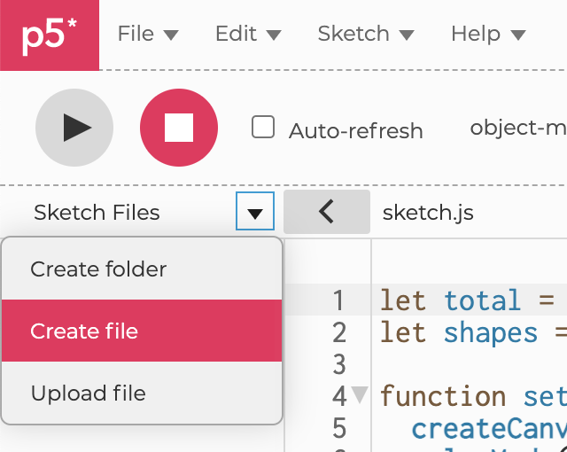

## Week 4: Organization & More Objects

[back to main](../index.md)

### Organizing your code into multiple files

* Code organization:
  * sketch.js: reserve for p5.js special functions like `setup()`, `draw()`, `preload()`, `mousePressed()`, `keyPressed()`...
  * Create new files for Class definitions
  * Separation of files by tasks / purpose



* Creating a new file in p5.js web editor:
  * Open the Sketch Files panel on the left (click on gray "<" button)
  * Click "Create file"
  * Give it a file name WITH the appropriate file extention (.js for JavaScript files, .html for HTML files, and .css for CSS files)
    * Conventionally, name files that contain Class definitions same as the class name (with first letter capitalized).
    * For example: Ball.js (for a JavaScript file containing Ball class), Particle.js (for file containing Particle class)

```html
  <body>
    <script src="Shape.js"></script>
    <script src="sketch.js"></script>
  </body>
```

* Including the new JavaScript file in the index.html file: You must do this in order to actually use the JavaScript file in the webpage
  * Above the `<script>` tag with `src` attribute of `"sketch.js"`, add another `<script>` tag
  * Provide the name of your new JavaScript file as the `src` attribute, between quotation marks

### Pseudocode

* What is [Pseudocode](https://en.wikipedia.org/wiki/Pseudocode)?
  * Plain language description of steps in an algorithm (logic)
  * Helps to think about programming complex systems
* Writing pseudocode:
  * What is the purpose of the program? What does your program display / do?
    * In sequential order
    * In logical steps
  * Use appropriate naming conventions
  * Use standard programming structures (if-then, for, while...)
  * Keep it simple but don't make it abstract
* Example: draw grid of ellipses

```
for i from 0 to 9 incrementing by 1
	for j from 0 9 incrementing by 1
		draw ellipse at (i * 50, j * 50) with width of 30 and height of 20
```

* Example: detect edges

```
if xpos is less than 0 or greater than width
	xSpeed is xSpeed times -1
if ypos is less than 0 or greater than height
	ySpeed is ySpeed times -1
```

### Objects talking with other objects

* [Example Code](https://editor.p5js.org/js6450/sketches/uamQF7Jnv)
* Using a nested for-loop to check each object to all other objects in an array:

```js
// Loop through all Ball objects in balls array
for (let i = 0; i < balls.length; i++) {
  let ball = balls[i];

  // Loop through all Ball objects in balls array again for each ball
  for (let j = 0; j < balls.length; j++) {
    // Don't check collision with itself
    if (i != j) {
      let other = balls[j];
      // Check collision with other ball
      ball.collide(balls[j]);
    }
  }

  ball.update();
  ball.display();
}
```

* Passing an object as argument of a class method:

```js
collide(other) {
  // Calculate distance between two points
  let d = dist(this.x, this.y, other.x, other.y);

  // If distance is less than half size of this Ball and half size of another Ball
  if (d < this.size / 2 + other.size / 2) {
    // Inverse speed of this ball
    // But why not the other? (Give it a try and see what happens)
    this.xSpeed *= -1;
    this.ySpeed *= -1;

    // Randomize hues of both Ball objects
    this.hue = random(360);
    other.hue = random(360);
  }
}
```

* Calculating distance between two points using `dist()` function
* Some notes on simulating collision:
  * Why is it not perfect?
  * Can you just flip xSpeed and ySpeed?
  * How can you perfect this more?
  * We will look at how to improve this using vectors next week (week 5)

### Objects talking to Mouse

* [Example Code](https://editor.p5js.org/js6450/sketches/bUuLa6l-N)
* What's the difference between `mouseIsPressed` variable and `mousePressed()` function?