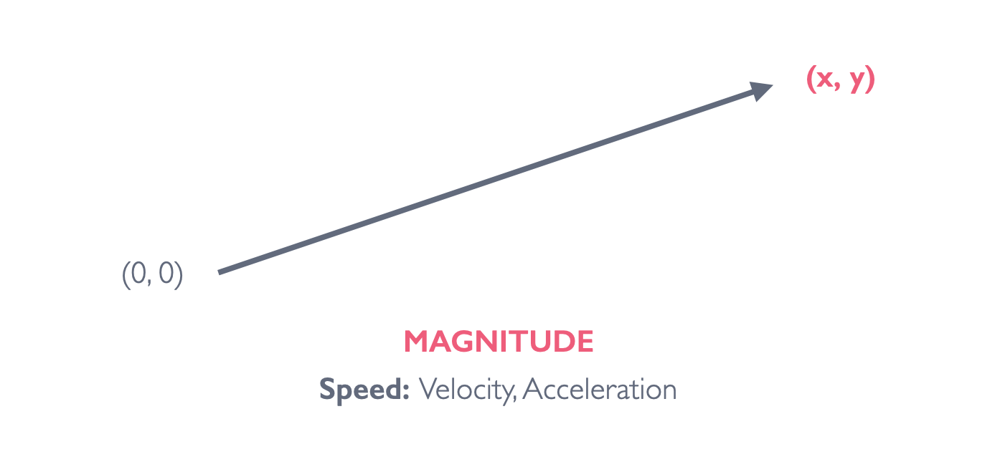

## Week 5: Vectors & JSON

[back to main](../index.md)

### Vectors



* A vector is an object that has both a **magnitude** and a **direction**.

```js
let pos = createVector(5, 3);
console.log(pos.x); // Output: 5
console.log(pos.y); // Output: 3
```

* You can create vectors with `createVector()` function in p5.js. Vectors in p5.js hold a set of x and y values.
  * The x and y values of the vector can be referenced as properities of the vector (using dot notation).

### Position, Velocity, Acceleration

* Acceleration changes velocity
  * Add acceleration to velocity

```js
let xPos = 0;
let xSpeed = 5;

xPos = xPos + xSpeed; // same as xPos += xSpeed;
```

* Previously, we updated our positions by incremeting the speed value like above

```js
let pos = createVector(0, 0);
let speed = (2, -3);

pos.add(speed);
```

* Same thing using vectors -- we add speed to position

* Velocity changes position
  * Add velocity to position
  * Acceleration is a result of some **FORCE**

### Vector Operations

* p5.Vector object: [documentation](https://p5js.org/reference/#/p5.Vector)
* [Adding](https://p5js.org/reference/#/p5.Vector/add) vectors

```js
pos.add(vel); // add vel to pos
```

* [Subtracting](https://p5js.org/reference/#/p5.Vector/sub) vectors

```js
vecOne.sub(vecTwo); // subtract vecTwo from vecOne, save result to VecOne
let subtracted = p5.Vector(vecOne, vecTwo); // subtract vectWo from vecOne, save rsult to subtracted
```

* [Multiplying](https://p5js.org/reference/#/p5.Vector/mult) scalar (static number) to vectors

```js
vel.mult(-1); // multiply -1 to vel
```

* [Dividing](https://p5js.org/reference/#/p5.Vector/div) scalar (static number) to vectors

```js
vel.div(2); // divide vel by 2
```

* [Getting magnitude](https://p5js.org/reference/#/p5.Vector/mag) (length = sqrt(x * x + y * y)) of vectors

```js
let magnitutde = vel.mag();
```

### Force

* Newton's Second Law: 
  * Force = Mass * Acceleration
  * In other words: Acceleration = Force / Mass

### Restitution

* The return to an original physical condition -- return to non-movement

### Bouncing Ball Collision with Vectors

* [Example Code](https://editor.p5js.org/js6450/sketches/_zFk1xRHN)

### Further Resources about Vectors

* [Chapter 1. Vectors](https://natureofcode.com/book/chapter-1-vectors/), Nature of Code by Daniel Shiffman
  * Note that this chapter is written for Processing -- focus on the explanation of concepts, pattern of code, **not** the code syntax


### What is an API?

* Application Programming Interface
  * [What is an API? In English, please](https://p5js.org/reference/#/p5.Vector/div) article by FreeCodeCamp
* Interface that defines interactions between multiple software intermediaries.
* Some APIs are [public](https://github.com/public-apis/public-apis) -- meaning we can use the data that may go back and forth within a program/platform for our own.

### JSON Objects

* What is [JSON](https://www.json.org/json-en.html)?

```js
let jiwon = {
  first_name: "Jiwon",
  last_name: "Shin",
  lives_in: "Brooklyn",
  num_of_siblings: 1,
  favorite_foods: ["Chocolate", "Hot Pot", "Korean BBQ"]
}

console.log(jiwon.favorite_foods); // Output: ["Chocolate", "Hot Pot", "Korean BBQ"]
console.log(jiwon.lives_in); // Output: "Brooklyn"
```

* An *JSON object* is an unordered set of name/value pairs. An object begins with `{` left brace and ends with `}` right brace. Each name is followed by `:`colon and the name/value pairs are separated by `,` comma.
* Looping through data in JSON:

```js
for(data in jiwon){
  console.log(data) // prints the names
  console.log(jiwon[data]) // prints values
}
```

### Data Visualizations with APIs:

* [Example Code](https://editor.p5js.org/js6450/sketches/AnqoTwjcp)
* JSON objects from external locations can be loaded using the `loadJSON()` function.

### APIs that require keys

* Some APIs require an API key (and more) -- to keep track of who is using their data and to control the data flow
* [Example Code](https://editor.p5js.org/js6450/sketches/-DbxKdis1)