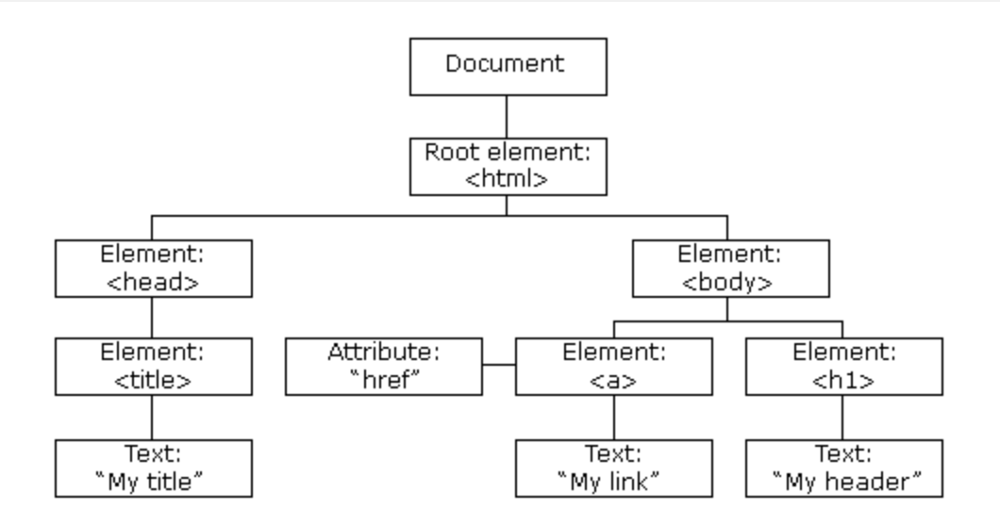
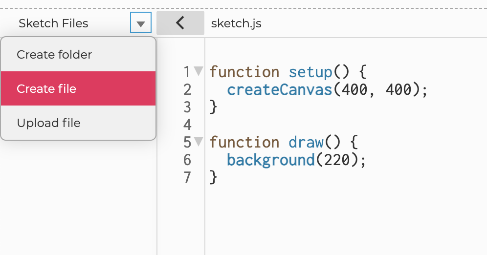
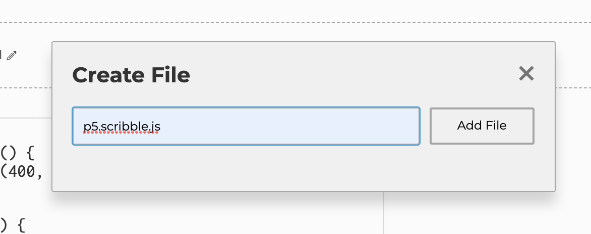
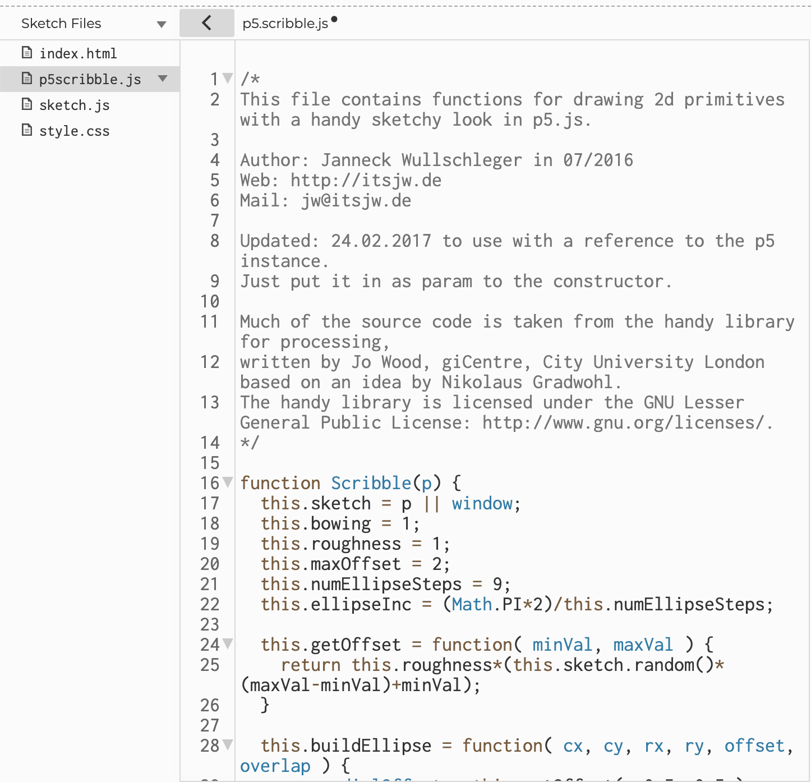

## Week 6: DOM and Sound

[back to main](../index.md)

### What is DOM?



(image from  [w3schools](https://www.w3schools.com/js/js_htmldom.asp))

* DOM: Document Object Model
  * A way of accessing HTML documents: referring to HTML elements as **objects**
* You can also create HTML elements using p5.js (JavaScript)
  * [References](https://p5js.org/reference/#group-DOM)
  * Remember that the canvas where we create our drawings inside of is also an HTML element (`<canvas>` element) and exists inside of an HTML document (index.html)
  * Note: This used to be a separate p5.js add-on library (was called p5.dom.js) -- the library has been integrated with the main p5.js library


### Creating UI with DOM

* [Example Code](https://editor.p5js.org/js6450/sketches/0wBf-wp5G)

* We can create a user interface (UI) that controls different elements of our p5.js sketches
* Creating HTML elements: 
  * Any functions under the DOM section of the references starting with `create` will create that HTML element.
  * For example, the `createSlider()` function will create an input slider
* Using created HTML elements 
  * HTML elements are accessed via Document Object Model -- they are **objects** and objects have methods
  * [List of p5.js methods](https://p5js.org/reference/#/p5.Element) available for DOM objects
  * You can also attach user events (mouse and keyboard events) to an HTML element using the relevant method.


### p5.sound library

* [Library references](https://p5js.org/reference/#/libraries/p5.sound)
* The p5.sound library is an add-on library: It is a separate library, but is also dependant on the main p5.js library

```html
<script src="https://cdnjs.cloudflare.com/ajax/libs/p5.js/1.2.0/addons/p5.sound.min.js"></script>
```

* In index.html file of the default project on the p5.js web editor, you will see that the p5.sound library is included in the HTML document via a `<script>` tag AFTER the main p5.js library is included. 
* The p5.sound library contains code that allow you to use web audio functionalities such as:
  * Using sound external sound files
  * Using microphone input
  * Analyzing sound data (amplitude, FFT)
  * Generating sound using oscillator


### Loading and Playing Sound Files

* External sound files must be uploaded to the p5.js web editor
* The sound files must be loaded into the p5.js sketch inside the `preload()` function

```js
let sound;

// Load sound file before setup() function runs
function preload(){
  // Load the sound file saved as "starling.mp3"
  sound = loadSound('starling.mp3');
}
```

* The `preload()` function runs BEFORE the `setup()` function runs and is generally used to load external assets used inside the p5.js sketch.

* You can play or loop sound files, usually inside the `setup()` function, by calling the `play()` or `loop()` method

```js
function setup() {
  createCanvas(windowWidth, windowHeight);
  
  // Loop sound file
  sound.loop();
}
```


### Visualizing Amplitude

* [Example Code](https://editor.p5js.org/js6450/sketches/yRnV7E9eH)
* You can get the dynamic amplitude level (how loud the sound is) of a sound file / microphone input first by creating an instance of the `p5.Amplitude` class.

```js
let amp;

function setup() {
  createCanvas(windowWidth, windowHeight);
  
  // Loop sound file
  sound.loop();
  // Create a new instance of p5.Amplitude() object
  amp = new p5.Amplitude();
}
```

* Then, you can get the amplitude level of the sound file for at current time inside the `draw()` function like below:

```js
function draw() {
  // getLevel() method returns the amplitude level between 0 and 1 at the time the method is called
  // If level is 0, there is no sound (silence)
  // If level is 1, it is at its loudest
  let level = amp.getLevel();
}
```


### FFT

* FFT: [Fast Fourier Transform](https://en.wikipedia.org/wiki/Fast_Fourier_transform)
* An analysis algorithm that isolates individual [audio frequencies](https://en.wikipedia.org/wiki/Audio_frequency) within a waveform
* To types of analysis:
  * Spectrum
  * Waveform
* You can analyize the sound file first by creating an instance of the `p5.FFT` object

```js
function setup() {
  createCanvas(windowWidth, windowHeight);
  
  // Loop sound file
  sound.loop();
  // Create a new instance of p5.FFT() object
  fft = new p5.FFT();
}
```


### FFT: Spectrum

* [Example Code](https://editor.p5js.org/js6450/sketches/oWAOKGOMS)
* Returns an array of amplitude values (between 0 and 255) across the frequency spectrum.
*  The array indices correspond to frequencies (i.e. pitches), from the lowest to the highest that humans can hear. Each value represents amplitude at that slice of the frequency spectrum. 


### FFT: Waveform

* [Example Code](https://editor.p5js.org/js6450/sketches/csH9A0zv4)
* Returns an array of amplitude values (between -1 and 1) that represent a snapshot of amplitude readings in a single buffer. 
  * Buffer: a chunck of data -- in this case, a chunk of time (very small amount of time)


### Combining Spectrum and Waveform Together

* [Example Code](https://editor.p5js.org/js6450/sketches/RlnE-qTwb)


### Other Libraries

* [Full list of libraries](https://p5js.org/libraries/) that work well with p5.js

* [p5.scribble.js](https://github.com/generative-light/p5.scribble.js): A library that gives p5.js 2D primitives a sketchy look

  * [Library](https://raw.githubusercontent.com/generative-light/p5.scribble.js/master/p5.scribble.js): Raw code
  * To use the library, copy the contents of the raw code linked above, create a new file in the p5.js web editor (give it a name like "p5.scribble.js") and paste the library code in the newly created file. 
    * 
    * 
    * 
  * Then, add the library as a `<script>` tag in the `<head>` section AFTER the script tags for p5.js core libraries

  ```html
    <head>
      <script src="https://cdnjs.cloudflare.com/ajax/libs/p5.js/1.2.0/p5.js"></script>
      <script src="https://cdnjs.cloudflare.com/ajax/libs/p5.js/1.2.0/addons/p5.sound.min.js"></script>
      <!-- ADD the line below to link the p5.scribble library to the web page -->
      <script src="p5.scribble.js"></script>
      <link rel="stylesheet" type="text/css" href="style.css">
      <meta charset="utf-8" />
    </head>
  ```

  * [Example Code](https://editor.p5js.org/js6450/sketches/y-a_50hHz)