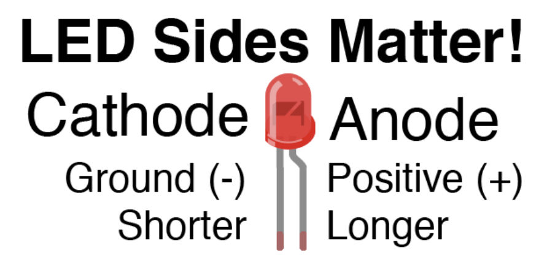
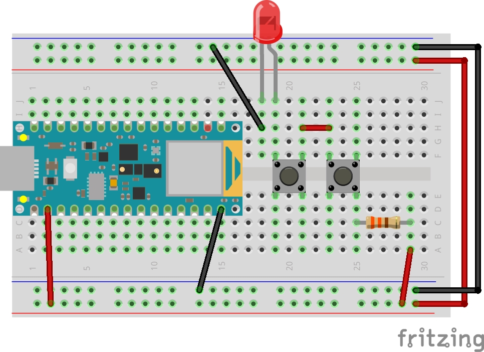

## Week 9: Electricity & Switches

[back to main](../index.md)

### Your Arduino Kit

* List of items in your kit:

  * [Arduino Nano 33 BLE](https://store.arduino.cc/usa/nano-33-ble-with-headers) board
  * Breadboard: this is where you will create your circuits!
  * Wires: colors have no functional differences, but it will visually help you
  * Wire to connect your Arduino board to your computer
  * Resistors: 
    * 10K Ohm resistor: color code is brown, black, organge, gold
    * 330 Ohm resistor: color code is orange - orange - brown (black) - gold
  * LEDs:
    * Some red, blue, green, yellow LEDs
    * One RGB LED
  * Servo Motor with wings
  * Switches
  * Potentiometers (variable resistors)
  * Photocells (variable resistors)

* Setting up your board:

  * [Pinout diagram](https://content.arduino.cc/assets/Pinout-NANOble_latest.pdf) for Arduino Nano 33 BLE

  

  

  * Push your Arduino board into the breadboard
    * It will be difficult to remove and attach back to breadboard (repeated use of the headers can also cause them to break and fixing them will be very paintful). My advice is to leave it attach to the board.
  * Connect the +3V3 pin (second pin on the left side) to the power bus on the Arduino
  * Connect a ground pin (second pin from the bottom on the left side) to the ground bus on the Arduino
  * Connect power from one side of breadboard to another
  * Connect ground from one side of breadboard to another

### Electricity

* Notes from [Understanding Electricity](http://www.tigoe.com/pcomp/code/circuits/understanding-electricity/) by Tom Igoe
* **Electricity** is the flow of electrical enegergy through some conductive material
* An **electrical circuit** is made up of two elements: a power source and components that convert the electrical energy into other forms of energy.  We build electrical circuits to do work, or to sense activity in the physical world.
* The process of changing one energe into another is called **transduction**, and devices that do it are called **transducers**.

#### Measurements

* **Voltage** is a measure of the difference in electrical potential energy between two points in a circuit. It is measured in **Volts**.
* **Current** is a measure of the magnitude of the flow of electrons through a particular point in a circuit. It is measured in **Amperes**, or **Amps**.
* **Resistance** is a measure of a material’s ability to oppose the flow of electricity. It is measured in **Ohms**.
* The relationship of voltage, current and resistance is described by the Ohm's law (V = I * R)

#### Circuits

* Every circuit has to have a **source** of electrical energy and a **load** that uses the energy.All of the electrical energy in a circuit has to get used by the load. 
* A circuit with no load  is called a **short circuit**.
* Electricity will always follow the path of least resistance.
* Everything must eventually connect to ground.
* There are two common kinds of circuits:  **Direct Current (DC)**, and **Alternating Current (AC).** In a DC circuit, current always flows one direction. In an AC circuit, the direction of current flow is reversed in a regular repeating cycle.  Most of the circuits we’ll talk about in this class will be DC circuits.
* Circuits can be in **series** or in **parallel**.
  * Read Sparkfun's tutorial on [series and parallel circuits](https://learn.sparkfun.com/tutorials/series-and-parallel-circuits/all)

#### Schematics

* [Intro to Schematic Diagrams](https://vimeo.com/380345253)
* **Schematic diagrams** are diagrams of circuits that represent the electrical relationships between the components in the circuit.
* A schematic doesn’t  always show the spatial arrangement of the components; it’s arranged so that you can best understand the flow of the electricity. 

### Microcontroller

* **Computer** and **processor** are generic terms for the anything that can run a program, basically. **Controller** or **microcontroller** is usually reserved for a simple processor that does only one task, like listening to sensors.
* Our Arduino board is a microcontroller and there are [many](https://store.arduino.cc/usa/arduino-uno-rev3) [other](https://store.arduino.cc/usa/mega-2560-r3) [types](https://www.raspberrypi.org/products/raspberry-pi-4-model-b/) of microcontrollers

### Components

#### Resistors

* **Resistors** resist, but do not totally block, the flow of electricity. They are used to control the flow of current. Current can move either way through a resistor, so it doesn’t matter which way they’re connected in a circuit. Resistors are measured by their resistance in o**hms** (Ω), often seen in **kilohms (kΩ)**. 
* [Schematics: Basic Symbols -- resistors, variabe resistors, and photocells](https://vimeo.com/380345304#t=0m40s)

#### Diodes

* **Diodes** permit the flow of electricity in one direction, and block it in the other direction. Because of this, they can only be placed in a circuit in one direction. **Light-Emitting Diodes** (LED’s) are special types of diodes which emit light when current flows through them.

* [Schematics: Basic Symbols -- diodes and LEDs](https://vimeo.com/380345304#t=3m12s)

#### Switches

* **Switches** and **push buttons** control the flow of current through a junction in a circuit
* [Schematics: Basic Symbols -- switches](https://vimeo.com/380345304#t=4m52s)

### Switches

* Simple switch using 1 LED, 1 switch and 1 330 ohm resistor

* Switches in series using 1 LED, 2 switches and 1 330 ohm resistor

* Switches in parallel using 1 LED, 2 switches and 1 330 ohm resistor

### LEDs

* LEDs in series using 2 LED, 1 switch and 1 330 ohm resistor

* LEDs in parallel using 2 LED, 1 switch and 1 330 ohm resistor

### Using Multimeters

* A multimeter can measure continuity, resistance, voltage and sometimes even current, capacitance, temperature, etc.
* Take a look at Adafruit's [guide to using Multimeters](https://learn.adafruit.com/multimeters/overview)